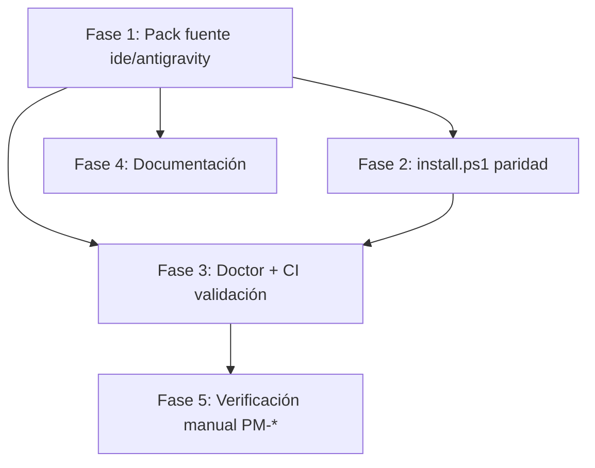

# Plan: Paridad instalador Antigravity — workflows `/flow-*` y skill `forge-discovery`

**Feature slug:** `fix-antigravity-forge-discovery`  
**Spec:** `.ai-work/fix-antigravity-forge-discovery/spec.md` (CKP-1 aprobado)  
**Assumptions (OQ-*):** OQ-1 sync `.agents/` → `ide/antigravity/`; OQ-2 no tocar `skills.json`; OQ-3 CI falla / doctor advierte (exit 0, `--strict` opcional); OQ-4 todos `skills/forge-*` (8 dirs); OQ-5 generación build = v2.

---

## 1. Impact and dependencies

### Qué cambia

| Componente | Estado actual | Cambio |
|------------|---------------|--------|
| `ide/antigravity/workflows/` | 6/7 sin frontmatter YAML | Sincronizar desde `.agents/workflows/` (7/7 con `description:`) |
| `ide/antigravity/rules/workflow.md` | Sin `alwaysApply: true` | Añadir frontmatter paridad `.agents/rules/workflow.md` |
| `ide/install.ps1` | Escribe en `%LOCALAPPDATA%\...\antigravity\`; sin skills | Migrar a `%USERPROFILE%\.gemini\config\`; skills + cleanup legacy + GEMINI.md |
| `flowforge doctor` | Solo verifica existencia de `~/.gemini/config/` | Validar frontmatter workflows + `forge-discovery` skill (global y proyecto) |
| CI `test-installer.yml` | Cuenta workflows; no valida FM ni skills | Assert 7 workflows con FM + `config/skills/forge-discovery/SKILL.md`; job Windows Antigravity |
| Docs `ide/antigravity/AGENTS.md`, `ide/README.md`, etc. | Rutas legacy `~/.gemini/antigravity/` | Actualizar a `config/` + nota reload + skills symlinks |

### Qué NO cambia (NFR-005)

- Packs Cursor / OpenCode / VS Code
- Compilación de skills en agents (patrón Cursor)
- `FlowForgeModule.InstallAntigravity()` destino `config/` (ya correcto en C#)
- `ide/install.sh` lógica Antigravity global/proyecto (ya correcta; solo beneficia del pack fuente corregido)

### Dependencias entre fases



### Patrones canónicos a seguir

| Patrón | Archivo | Uso en este fix |
|--------|---------|-----------------|
| Skills symlink/copy | `FlowForgeModule.InstallAntigravitySkills()` L346–369 | Replicar en `install.ps1` `Install-AntigravitySkills` |
| Skills bash | `ide/install.sh` `install_antigravity_skills()` L114–129 | Referencia fallback `/tmp` → copia recursiva |
| Global install bash | `ide/install.sh` `install_antigravity_global()` L138–154 | Inventario artefactos para PS1 |
| Rutas Windows | `PathHelper.AntigravityConfigDir` | `%USERPROFILE%\.gemini\config\` |
| Legacy cleanup | `CleanupLegacyAntigravityPack()` / `cleanup_legacy_antigravity_pack()` | PS1 debe llamar equivalente |

### MCP Engram (nota de alcance)

`mcp_config.json` lo escribe **solo** `EngramModule` vía `flowforge install`. Ni `install.sh` ni `install.ps1` lo generan hoy. **Decisión de plan:** paridad PS1 ↔ bash (no añadir MCP en shell v1); documentar en AGENTS.md que Engram/MCP requiere `flowforge install`. FR-009 escenario B compara con `install.sh`, no solo C#.

---

## 2. File changes (Proposed Changes)

### Fase A — Pack fuente (FR-001, FR-002, FR-003)

- [MODIFY] `ide/antigravity/workflows/flow-start.md` — Añadir frontmatter; cuerpo = `.agents/workflows/flow-start.md` (sin FM)
- [MODIFY] `ide/antigravity/workflows/flow-plan.md` — Idem
- [MODIFY] `ide/antigravity/workflows/flow-dev.md` — Idem
- [MODIFY] `ide/antigravity/workflows/flow-verify.md` — Idem
- [MODIFY] `ide/antigravity/workflows/flow-close.md` — Idem
- [MODIFY] `ide/antigravity/workflows/flow-rework.md` — Idem
- [MODIFY] `ide/antigravity/workflows/flow-status.md` — Verificar FM ya presente; alinear cuerpo con `.agents/` si diverge
- [MODIFY] `ide/antigravity/rules/workflow.md` — Añadir frontmatter `alwaysApply: true` + `description:` (copiar de `.agents/rules/workflow.md` L1–4)
- [MODIFY] `.agents/workflows/*.md` — Solo si divergen en cuerpo post-sync; objetivo: paridad operativa con `ide/antigravity/` tras el fix (FR-002)

### Fase B — `install.ps1` Windows (FR-004–FR-009, FR-015)

- [MODIFY] `ide/install.ps1` — Reemplazar bloque Antigravity global L254–271:
  - Destino: `$env:USERPROFILE\.gemini\config\` (+ espejo `config\.agents\{rules,workflows,skills}\`)
  - Nueva función `Install-AntigravitySkills` (symlink `CreateSymbolicLink` → fallback `Copy-Item -Recurse`)
  - Nueva función `Remove-LegacyAntigravityPack` (eliminar `antigravity\AGENTS.md`, `rules\`, `workflows\`; borrar `config\skills.json` si existe)
  - Copiar `rules\workflow.md` → `$env:USERPROFILE\.gemini\GEMINI.md`
  - Detección: `Test-Path "$env:USERPROFILE\.gemini"` (no priorizar `LOCALAPPDATA\Google\Gemini` para destino)
- [MODIFY] `ide/install.ps1` — `Install-ProjectBundle` L103–110:
  - Crear `.agents\skills\`; llamar `Install-AntigravitySkills` hacia `{repo}\.agents\skills`
  - Copiar `AGENTS.md` a `.agents\AGENTS.md` (paridad C# `InstallAntigravityProject`) además de raíz si no existe otro `AGENTS.md`
  - Usar `$FlowForgeRepo` / cache `~\.flowforge\cache\FlowForge` para symlinks en install remoto (NFR-004)

### Fase C — Doctor + CI (FR-010–FR-012)

- [NEW] `scripts/validate-antigravity-pack.sh` — Valida pack **fuente** en repo: 7 `flow-*.md` con FM + `description:` línea única; `workflow.md` con `alwaysApply: true`
- [MODIFY] `.github/workflows/test-installer.yml` — Linux step Antigravity L161–170: añadir frontmatter check + `test -f ~/.gemini/config/skills/forge-discovery/SKILL.md` + `WF_COUNT -eq 7`
- [MODIFY] `.github/workflows/test-installer.yml` — Windows: nuevo step "Verificar — Antigravity (Windows)" post-install: `config\workflows\` (7 archivos), FM, `forge-discovery` skill, ausencia legacy `antigravity\`
- [MODIFY] `.github/workflows/test-installer.yml` — Job smoke o lint: ejecutar `scripts/validate-antigravity-pack.sh` **antes** de install (falla PR sin FM en fuente)
- [MODIFY] `scripts/docker-pm1-test.sh` — Añadir checks: frontmatter en workflows instalados + `config/skills/forge-discovery/SKILL.md`
- [MODIFY] `src/FlowForge.Installer/Commands/DoctorCommand.cs` — Nuevos checks Antigravity:
  - `Antigravity: workflows frontmatter` (global `config/global_workflows/` + proyecto `.agents/workflows/` si `.flowforge.json`)
  - `Antigravity: skill forge-discovery` (global + proyecto)
  - Flag `--strict` en `RunAsync`: si falla check Antigravity → exit 2 (OQ-3)
- [NEW] `src/FlowForge.Installer/Infrastructure/AntigravityPackValidator.cs` — Lógica compartida doctor + opcional pre-flight en `FlowForgeModule` (warn en install si destino post-copia carece FM)

### Fase D — Documentación (FR-013, FR-014)

- [MODIFY] `ide/antigravity/AGENTS.md` — Rutas `~/.gemini/config/` y `%USERPROFILE%\.gemini\config\`; sección skills symlinks; requisito frontmatter; reload post-install; nota `skills.json` no soportado (OQ-2)
- [MODIFY] `.agents/AGENTS.md` — Misma corrección rutas (copia instalada en proyectos)
- [MODIFY] `ide/README.md` — Fila Antigravity → `config/`
- [MODIFY] `README.md` / `README.es.md` — Si aún citan `antigravity/` como destino global
- [MODIFY] `docs/decisions/ADR-008-ide-installer-path-matrix.md` — Fila Antigravity apuntar a ADR-009 / `config/` (referencia cruzada, no reescribir ADR-009)
- [MODIFY] `QUICKSTART.md` / `QUICKSTART.es.md` — Troubleshooting: reload Antigravity antes de reinstalar (FR-014)

### Sin cambios de código esperados (verificar solo)

- `src/FlowForge.Installer/Modules/FlowForgeModule.cs` — `InstallAntigravity*` ya correcto; opcional: llamar `AntigravityPackValidator` antes de `CopyGlob` workflows
- `ide/install.sh` — Sin cambios lógicos; validar que copia pack corregido
- `src/FlowForge.Installer/Commands/InitCommand.cs` — Ya llama `InstallAntigravityProject`

---

## 3. Contracts and schemas

### Frontmatter workflow (obligatorio — ADR-009)

```yaml
---
description: <texto corto una sola línea, sin multilínea con >
---
```

**Tabla de `description:` canónica** (copiar exactamente desde `.agents/workflows/`):

| Archivo | `description:` |
|---------|----------------|
| `flow-start.md` | `Iniciar feature FlowForge (Discovery a Spec, CKP-0 y CKP-1)` |
| `flow-plan.md` | `Fase Plan (CKP-2) — plan.md desde spec aprobado` |
| `flow-dev.md` | `Fase Dev — implementacion segun plan.md aprobado` |
| `flow-verify.md` | `Fase Verify — auditoria de implementacion vs spec` |
| `flow-close.md` | `Fase Memory y cierre (CKP-4 deploy gate)` |
| `flow-status.md` | `Mostrar fase actual leyendo .ai-work/ sin delegar` |
| `flow-rework.md` | `Intake de bug — rework_ticket y delegacion a forge-dev` |

### Frontmatter regla orquestador

```yaml
---
alwaysApply: true
description: FlowForge orchestrator checkpoints and phase delegation for Antigravity.
---
```

### Rutas destino (contrato instalador)

```json
{
  "linux": {
    "global_config": "~/.gemini/config/",
    "global_skills": "~/.gemini/config/skills/forge-*/SKILL.md",
    "global_mirror": "~/.gemini/config/.agents/{rules,workflows,skills}/",
    "global_always_on": "~/.gemini/GEMINI.md",
    "project_skills": "{repo}/.agents/skills/forge-*/SKILL.md",
    "legacy_rejected": "~/.gemini/antigravity/"
  },
  "windows": {
    "global_config": "%USERPROFILE%\\.gemini\\config\\",
    "global_skills": "%USERPROFILE%\\.gemini\\config\\skills\\forge-discovery\\SKILL.md",
    "global_mirror": "%USERPROFILE%\\.gemini\\config\\.agents\\",
    "global_always_on": "%USERPROFILE%\\.gemini\\GEMINI.md",
    "legacy_rejected": "%LOCALAPPDATA%\\Google\\Gemini\\antigravity\\"
  }
}
```

### Firma PowerShell — `Install-AntigravitySkills`

```powershell
function Install-AntigravitySkills {
    param(
        [string]$DestDir,      # e.g. $config\skills or $repo\.agents\skills
        [string]$FlowForgeRepo # clone or ~/.flowforge/cache/FlowForge
    )
    # foreach skills/forge-*:
    #   $target = Join-Path $DestDir $name
    #   remove existing $target
    #   try { New-Item -ItemType SymbolicLink -Target $skillDir -Path $target }
    #   catch { Copy-Item -Recurse $skillDir $target }
}
```

### Firma C# — `AntigravityPackValidator` (nuevo)

```csharp
public static class AntigravityPackValidator
{
    public record ValidationIssue(string File, string Rule, string Remediation);

    /// <summary>Valida pack fuente o instalado.</summary>
    public static IReadOnlyList<ValidationIssue> ValidateWorkflows(string workflowsDir);
    public static bool HasForgeDiscoverySkill(string skillsDir);
    public static bool WorkflowHasValidFrontmatter(string filePath);
}
```

**Regla FM:** archivo empieza con `---`; segunda línea contiene `description:`; cierre `---` antes de cuerpo; cuerpo no empieza con `# /flow-` sin bloque previo.

### Skills instalados (set completo — OQ-4)

```
forge-arch, forge-dev, forge-discovery, forge-memory, forge-orchestrator,
forge-plan, forge-teacher, forge-verify
```

**Rechazado:** escribir `skills.json` en `config/` o `.agents/` (FR-007).

### Doctor mensajes (NFR-006)

| Check | Mensaje ejemplo | Remediation |
|-------|-----------------|-------------|
| FM faltante | `flow-plan.md: falta description: en frontmatter` | `flowforge install` o actualizar FlowForge |
| Skill ausente | `config/skills/forge-discovery/SKILL.md no encontrado` | `flowforge install` / `ide/install.ps1` |
| Ruta legacy | `Pack legacy en antigravity/workflows/ detectado` | Re-ejecutar install corregido |

---

## 4. Implementation checklist

### Fase 1 — Pack fuente Antigravity (A) — **7 tareas**

- [x] **1.1** [FR-001] Crear script local de sync (one-off en dev): para cada `flow-*.md`, prepend FM desde tabla §3 y cuerpo desde `.agents/workflows/{name}.md` → escribir en `ide/antigravity/workflows/{name}.md`
- [x] **1.2** [FR-002] Diff manual los 7 pares; resolver divergencias de contenido operativo (delegaciones, nombres agente) — prioridad: `.agents/` como referencia de orquestación
- [x] **1.3** [FR-003] Copiar frontmatter de `.agents/rules/workflow.md` a `ide/antigravity/rules/workflow.md` (preservar cuerpo existente)
- [x] **1.4** [FR-001] Verificar que ningún workflow usa `description: >` multilínea ni líneas vacías dentro del bloque YAML
- [x] **1.5** [FR-002] Alinear `.agents/workflows/` con `ide/antigravity/workflows/` si el sync invirtió diferencias menores (mismo PR, paridad bidireccional)
- [x] **1.6** [FR-010] Implementar `scripts/validate-antigravity-pack.sh` apuntando a `ide/antigravity/workflows/` y `ide/antigravity/rules/workflow.md`
- [x] **1.7** [FR-010] Ejecutar validador localmente; debe pasar antes de continuar a Fase 2

### Fase 2 — `install.ps1` migración Windows (B, C) — **8 tareas**

- [x] **2.1** [FR-008] Definir `$AntigravityConfig = Join-Path $env:USERPROFILE ".gemini\config"`; eliminar uso de `$globalGemini\antigravity` como destino de escritura
- [x] **2.2** [FR-005, FR-004] Implementar `Install-AntigravitySkills` siguiendo `FlowForgeModule.InstallAntigravitySkills()` + fallback copia si repo en temp (`$IsRemote`)
- [x] **2.3** [FR-008, FR-009] Reescribir bloque global: copiar AGENTS, rules, workflows a `config\` y `config\.agents\`; instalar skills en ambos `skills\`; copiar `workflow.md` → `GEMINI.md`
- [x] **2.4** [FR-008] Implementar `Remove-LegacyAntigravityPack`: borrar `%USERPROFILE%\.gemini\antigravity\{AGENTS.md,rules,workflows}` y `%LOCALAPPDATA%\Google\Gemini\antigravity\` si FlowForge escribió ahí
- [x] **2.5** [FR-006] Extender `Install-ProjectBundle`: `.agents\skills\` + `Install-AntigravitySkills`; copiar `AGENTS.md` a `.agents\` (paridad `InstallAntigravityProject`)
- [x] **2.6** [FR-007] Confirmar que PS1 no crea `skills.json` en ninguna ruta
- [ ] **2.7** [FR-015] Matriz de prueba manual Windows: ejecutar `install.ps1` en máquina limpia; listar `config\workflows\` (7), `config\skills\forge-discovery\`, ausencia legacy
  > Pending: PM-2 — requiere máquina Windows + reload Antigravity
- [ ] **2.8** [NFR-003] Re-ejecutar `install.ps1`; verificar `head` de `flow-start.md` conserva FM (idempotencia)
  > Pending: PM-2 / PM-5 — verificación manual Windows

### Fase 3 — Doctor y CI (D) — **7 tareas**

- [x] **3.1** [FR-010] Crear `AntigravityPackValidator.cs` con reglas FM y helper `HasForgeDiscoverySkill`
- [x] **3.2** [FR-012] Integrar en `DoctorCommand.cs`: checks global workflows FM, global skill discovery, proyecto `.agents/skills/forge-discovery` si `IsFlowForgeProject`
- [x] **3.3** [FR-012, OQ-3] Añadir parámetro `--strict` a doctor; sin flag: issues Antigravity en tabla como FAIL visual pero exit 0 si solo Antigravity falla — **o** exit 2 solo con `--strict` (documentar en help)
- [x] **3.4** [FR-010, FR-011] CI Linux: step `validate-antigravity-pack.sh` en job lint/smoke; extender step L161–170 con FM + skill + count=7
- [x] **3.5** [FR-011] CI Windows: nuevo step Antigravity tras `flowforge.exe install` (y opcional step con `install.ps1` en job separado o matrix)
- [x] **3.6** [FR-011] Actualizar `scripts/docker-pm1-test.sh`: asserts FM + forge-discovery skill
- [x] **3.7** [NFR-006] Tests unitarios `AntigravityPackValidator` con fixtures: archivo sin FM, FM OK, skill dir ausente
  > Evidence: `AntigravityPackValidatorTests.cs` añadido; `validate-antigravity-pack.sh` PASS local. `dotnet test` bloqueado localmente (obj/ root-owned).

### Fase 4 — Documentación (E) — **4 tareas**

- [x] **4.1** [FR-013] Actualizar `ide/antigravity/AGENTS.md` y `.agents/AGENTS.md`: rutas `config/`, skills, frontmatter, no `skills.json`
- [x] **4.2** [FR-014] Añadir sección "Post-install" / troubleshooting: reiniciar Antigravity tras install
- [x] **4.3** [FR-013] Barrido `grep -r "gemini/antigravity"` en `ide/`, `docs/`, `README*`; corregir referencias como destino canónico
- [x] **4.4** [FR-013] ADR-008 matriz: nota "ver ADR-009 para Antigravity 2.0"

### Fase 5 — Verificación integrada (FR-015, PM-*) — **4 tareas**

- [ ] **5.1** Linux: `flowforge install` + `bash ide/install.sh` → ambos dejan 7 WF con FM y skills completos
  > Pending: PM-1 — humano
- [ ] **5.2** Windows: `flowforge install` + `install.ps1` → ambos usan `config\` (comparar inventario)
  > Pending: PM-2 — humano
- [ ] **5.3** Proyecto: `flowforge init .` en clone FlowForge → `.agents/skills/forge-discovery/SKILL.md` presente
  > Pending: PM-3 — humano
- [ ] **5.4** Marcar PM-1..PM-5 en `spec.md` tras pruebas manuales (CKP-4)

### Rework P0 — `global_workflows` path (2026-07-15) — **6 tareas**

- [x] **R.1** `PathHelper.AntigravityWorkflows` → `config/global_workflows`; `AntigravityLegacyWorkflowsDir` para migración
- [x] **R.2** `FlowForgeModule.MigrateLegacyWorkflowsDir()` — copia `config/workflows/flow-*.md` → `global_workflows/`
- [x] **R.3** `ide/install.sh` + `ide/install.ps1` — destino global `global_workflows` + migración legacy
- [x] **R.4** Doctor: check `Antigravity: legacy workflows dir`; CI/docker asserts en `global_workflows`
- [x] **R.5** Docs: ADR-009, `ide/antigravity/AGENTS.md`, QUICKSTART*, `ide/README.md`
- [x] **R.6** Tests: `PathHelperTests.FR_016`, `AntigravityPackValidatorTests.FR_016`

---

## 5. Traceability matrix (FR → tareas)

| FR | Tareas plan |
|----|-------------|
| FR-001 | 1.1, 1.4, 1.6, 1.7, 3.4 |
| FR-002 | 1.2, 1.5 |
| FR-003 | 1.3 |
| FR-004 | 2.2 (paridad bash ya OK; validar 5.1) |
| FR-005 | 2.2, 2.7 |
| FR-006 | 2.5, 5.3 |
| FR-007 | 2.6, 4.1 |
| FR-008 | 2.1, 2.3, 2.4 |
| FR-009 | 2.3, 2.7, 5.2 |
| FR-010 | 1.6, 3.1, 3.4 |
| FR-011 | 3.4, 3.5, 3.6 |
| FR-012 | 3.2, 3.3 |
| FR-013 | 4.1, 4.3, 4.4 |
| FR-014 | 4.2 |
| FR-015 | 2.7, 5.1, 5.2 |

---

## 6. Risks and mitigations

| Riesgo | Probabilidad | Impacto | Mitigación |
|--------|--------------|---------|------------|
| Symlink sin privilegio en Windows | Media | Medio | Fallback copia recursiva (patrón C#) |
| Usuario con pack legacy en `LOCALAPPDATA` | Alta | Alto | `Remove-LegacyAntigravityPack` + doctor alerta ruta legacy |
| Divergencia futura `.agents/` vs `ide/antigravity/` | Media | Alto | CI `validate-antigravity-pack.sh` en cada PR (OQ-5 v2: generador) |
| Doctor exit code rompe scripts existentes | Baja | Medio | OQ-3: warn por defecto; `--strict` para exit ≠ 0 |
| `install.ps1` sin MCP deja parser frágil | Baja | Medio | Documentar `flowforge install` para Engram; ADR-009 ya advierte MCP vacío |
| CI Windows no ejecuta `install.ps1` | Media | Medio | Tarea 3.5: step dedicado además de `flowforge.exe` |

---

## 7. Dev agent notes

1. **Orden estricto:** Fase 1 antes que 2 — install copia pack fuente; sin FM en fuente, reinstalar empeora destinos.
2. **No tocar** `skills.json` en repos usuario (OQ-2).
3. **Prueba rápida FM:** `head -5 ide/antigravity/workflows/flow-start.md` debe mostrar `---` / `description:` / `---`.
4. **Prueba rápida picker:** tras install + reload Antigravity, `/` debe listar 7 comandos `flow-*`.
5. **C# tests:** añadir proyecto test para `AntigravityPackValidator` si no existe fixture dir — usar `ide/antigravity/workflows/` como golden.

---

## Memory Signal

- **type:** decision
- **significance:** high
- **summary:** "Plan v1: sync frontmatter .agents→ide/antigravity pack; install.ps1 migra a %USERPROFILE%\\.gemini\\config\\ con Install-AntigravitySkills; CI validate-antigravity-pack.sh + doctor AntigravityPackValidator; MCP Engram sigue solo en flowforge install; doctor warn/CI fail per OQ-3."
