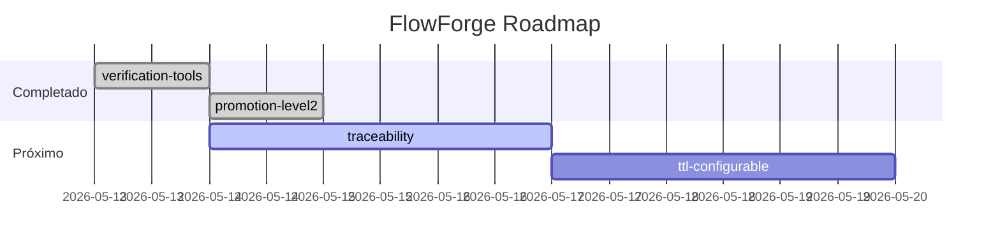

# FlowForge

> **Forja tu flujo de desarrollo con agentes de IA.**

FlowForge es una **metodología Agentic SDLC** diseñada para equipos pequeños y medianos (SMB, 2-20 personas). Define cómo integrar agentes de IA en el ciclo de desarrollo de software con 3 checkpoints humanos, 5 agentes, y un protocolo de artefactos versionados.

## Repositorios

| Proyecto | Descripción |
|----------|-------------|
| **FlowForge** (este) | Documentación de la metodología EngramFlow |
| **[engram-dotnet](https://github.com/efreet111/engram-dotnet)** | Motor de memoria persistente para agentes de IA (.NET 10) |

## Metodología EngramFlow

```
FASE 1: INTENCIÓN  → Checkpoint ① (Humano)  → spec.md
FASE 2: ARQUITECTURA → Checkpoint ② (Humano) → plan.md
FASE 3: EJECUCIÓN   → Inner Loop autónomo   → código + tests
FASE 4: CIERRE      → Checkpoint ③ (Humano)  → memoria + .md
```

- **4 fases**, **3 checkpoints humanos**, **5 agentes**
- **Orquestador AI opcional** — configurable desde JSON
- **Model routing** por tipo de tarea (Sonnet para razonar, Haiku para tareas baratas)
- **Memory Janitor** — pruning automático con TTL configurable

## Documentación

| Documento | Descripción |
|-----------|-------------|
| [`01-engramflow-architecture.md`](docs/01-engramflow-architecture.md) | Diseño completo de la metodología |
| [`02-memory-strategy.md`](docs/02-memory-strategy.md) | Estrategia de 2 niveles de memoria |
| [`03-engram-dotnet-gaps.md`](docs/03-engram-dotnet-gaps.md) | Análisis de gaps con engram-dotnet |
| [`04-roadmap.md`](docs/04-roadmap.md) | Roadmap conjunto |
| [`05-comparison-methodologies.md`](docs/05-comparison-methodologies.md) | Investigación de metodologías Agentic SDLC |

## Estado del proyecto



## Licencia

MIT
