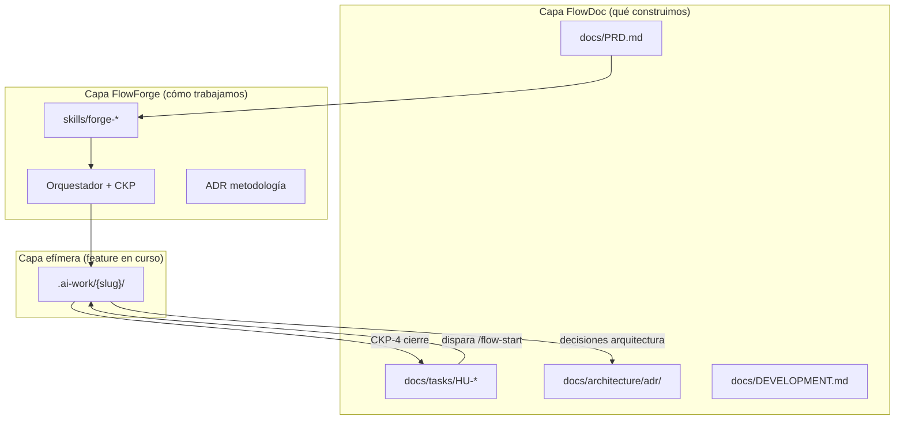

# FlowForge × FlowDoc — Propuesta de integración (borrador para discusión)

> **Estado**: Borrador — pendiente de revisión con mantenedores de FlowDoc  
> **Audiencia**: Cristian M. (FlowDoc) + colaboradores FlowForge  
> **Fecha**: 2026-06-14  
> **Versión FlowForge**: 0.4.1 · **Versión FlowDoc referenciada**: 1.1 (2026-06-05)  
> **Relacionado**: [ADR-002](decisions/ADR-002-scaffold-doc-policy.md) · [04-roadmap](04-roadmap.md) items 5–6 · [14-flowforge-complete-reference](14-flowforge-complete-reference.md)

---

## Resumen ejecutivo

FlowForge y FlowDoc ya se posicionan como **ecosistema complementario**:

> *"FlowForge minimizes SDD overhead; FlowDoc is the documentation that flows."* (README FlowDoc)

Esta propuesta define **cómo integrar FlowDoc como capa documental de producto** en la salida pública de FlowForge, sin duplicar ceremonias SDD ni crear dos fuentes de verdad conflictivas.

**Objetivo de la integración:** que un proyecto nuevo pueda ejecutar `flow-init`, obtener la estructura FlowDoc en `docs/`, instalar agentes FlowForge vía `ide/install`, y trabajar features con `/flow-start` → `.ai-work/{slug}/` mientras la documentación persistente vive en `docs/`.

**Horizonte propuesto:** ~4 días de implementación MVP en FlowForge (contrato + templates + `flow-init` + enganche mínimo en skills). Elementos avanzados (ADR-009 FlowDoc, scripts `hu-to-issues`, ciclo de 15 días automatizado) quedan para fases posteriores.

**Decisión que necesitamos alinear juntos:** dónde vive cada tipo de información cuando ambos frameworks conviven en el mismo repositorio.

---

## 1. Contexto

### 1.1 Qué es FlowForge hoy

FlowForge es una **metodología y toolchain para agentes IA** con:

| Elemento | Ubicación | Propósito |
|----------|-----------|-----------|
| Checkpoints CKP-0 → CKP-4 | Skills + orquestador | Gates humanos y mecánicos |
| 7 agentes (`forge-*`) | `skills/` + `ide/` | Roles por fase |
| Artefactos efímeros por feature | `.ai-work/{slug}/` | spec, plan, verify-report, summary |
| ADRs de metodología | `docs/decisions/` (repo FlowForge) | Por qué FlowForge funciona así |
| Instalador IDE | `ide/install.ps1` / `install.sh` | Skills, reglas, agentes en repo objetivo |

**Release gate actual:** casi completo. Pendientes críticos: `flow-init` (items 5–6), smoke OpenCode, epic OSS contributor.

### 1.2 Qué es FlowDoc hoy

FlowDoc es un **framework de documentación** para equipos pequeños (2–6), async-first, markdown-in-Git:

| Elemento | Ubicación | Propósito |
|----------|-----------|-----------|
| PRD, backlog, ADRs producto | `docs/` | Verdad persistente del producto |
| User Stories (HU) | `docs/tasks/HU-*` | Unidad de planificación |
| Templates | `docs/templates/` | HU simple vs SDD-Ready, RFC, ADR, etc. |
| Ciclo de equipo | `docs/flowdoc-ciclo.md` | Ritmo 15 días (Scrum adaptado) |
| Adopción gradual | L1 → L4 | Docs only → SDD → equipo → métricas |
| Patrón contexto subagentes | ADR-009 | `sdd-context.md` en `openspec/changes/` |
| Scripts | `hu-to-issues.*`, `flowdoc-migration.sh` | Automatización backlog → Issues |

**Validación empírica:** adopción en engram-dotnet (sesión 2026-06-01) — migración de `sdd/` + `openspec/` hacia `docs/tasks/HU-*`.

### 1.3 Por qué integrar ahora

FlowForge **ADR-002** ya decidió que `flow-init` generará `AGENTS.md`, `docs/DEVELOPMENT.md`, `docs/decisions/` en repos objetivo — pero **no tiene templates concretos**. FlowDoc los tiene probados.

Sin integración explícita, los adoptadores de FlowForge:

- Inventarán estructura `docs/` ad hoc  
- Duplicarán o contradirán convenciones FlowDoc  
- Mezclarán `.ai-work/` con `openspec/` (deuda ya corregida en FlowForge `docs/08`)  

---

## 2. Principio rector: dos capas, un repo



**Regla de oro:**

| Si… | Entonces va en… |
|-----|-----------------|
| Sobrevive al merge / es verdad del producto | `docs/` (FlowDoc) |
| Es trabajo en curso de una feature | `.ai-work/{slug}/` (FlowForge) |
| Define comportamiento de un agente por rol | `skills/forge-*/SKILL.md` |
| Define routing, gates, protocolos transversales | Orquestador (`workflow-orchestrator-parity.md`) |
| Es decisión de metodología FlowForge | `FlowForge/docs/decisions/` |
| Es decisión de arquitectura del producto | `docs/architecture/adr/` del repo objetivo |

---

## 3. Contrato de distribución de contenidos

Esta sección es el núcleo de la discusión. Define **qué no debe duplicarse** entre AGENTS.md, skills, orquestador y docs.

### 3.1 Dos `AGENTS.md` distintos

| Aspecto | `AGENTS.md` FlowForge (repo metodología) | `AGENTS.md` proyecto (generado por `flow-init`) |
|---------|------------------------------------------|--------------------------------------------------|
| **Propósito** | Índice de skills y triggers | Contexto del producto para cualquier agente |
| **Contiene** | Tabla 31 skills, CKP overview, paths skills | Stack, fuentes de verdad, reglas dominio, punteros |
| **NO contiene** | PRD, HUs, DEVELOPMENT completo | CKP detallado, Memory Curation, lista skills |
| **Tamaño objetivo** | ~100 líneas (índice) | ~40–60 líneas + enlaces |
| **Mantenido por** | Equipo FlowForge | Tech lead del producto |
| **Actualización** | Releases FlowForge | PRs del producto |

**Plantilla propuesta (proyecto):**

```markdown
# AGENTS.md — [Nombre del proyecto]

## Stack
[Lenguaje, framework, test runner, versión mínima]

## Fuentes de verdad
| Tema | Path |
|------|------|
| Producto | docs/PRD.md |
| Backlog | docs/tasks/ |
| Decisiones | docs/architecture/adr/ |
| Desarrollo | docs/DEVELOPMENT.md |
| Feature activa | .ai-work/{slug}/ |

## Workflow
FlowForge: /flow-start · /flow-plan · /flow-dev · /flow-verify · /flow-close
Guía: [QUICKSTART FlowForge](...)

## Reglas del agente (producto)
- El humano revisa y commitea; el agente propone.
- Documentación actualizada en el mismo PR que el código.
- Sin ADR aprobado en docs/architecture/adr/, la decisión técnica no existe.
- No modificar AGENTS.md ni docs/ sin aprobación del Tech Lead.
```

#### Pros

- Evita AGENTS.md de 500+ líneas imposibles de mantener.  
- Separación clara: metodología (FlowForge) vs dominio (producto).  
- Cualquier agente (Cursor, OpenCode, Claude Code) lee el mismo entry point del producto.  
- Alineado con ADR-002 ya aceptado en FlowForge.

#### Contras

- Dos archivos llamados `AGENTS.md` confunden a newcomers hasta que lean esta guía.  
- Requiere disciplina: no copiar skills FlowForge al AGENTS del proyecto.  
- Herramientas que asumen un solo AGENTS.md en la raíz no distinguen capas automáticamente.

#### Mejora sugerida (discutir)

- FlowDoc podría renombrar su template a `AGENTS.project.md` y `flow-init` lo copia como `AGENTS.md`.  
- O añadir frontmatter YAML `layer: product` vs `layer: methodology` para tooling futuro.

---

### 3.2 Skills (`skills/forge-*/SKILL.md`)

Los skills contienen **solo comportamiento por rol**, no documentación de producto ni política de equipo.

| Skill | Lee de `docs/` (FlowDoc) | Escribe |
|-------|--------------------------|---------|
| **forge-discovery** | `PRD.md`, índice HUs, ADRs recientes | `.ai-work/{slug}/context-map.md` |
| **forge-arch** | HU referenciada, context-map, mem_search | `.ai-work/{slug}/spec.md` |
| **forge-plan** | spec.md | `.ai-work/{slug}/plan.md`; opcional ADR producto |
| **forge-dev** | plan.md, `DEVELOPMENT.md` | código + tests |
| **forge-verify** | spec + plan + código | `verify-report.md` |
| **forge-memory** | `.ai-work/*` | `summary.md`; actualiza HU + CHANGELOG |

**NO va en skills:**

- Ciclo de 15 días, branching `dev/staging/main`, feature flags → `docs/flowdoc-ciclo.md`  
- Templates de HU/RFC → `docs/templates/` (referencia, no inline en skills)  
- Política XML / convenciones stack → `docs/DEVELOPMENT.md`  

#### Pros

- Skills permanecen portables entre IDEs y proyectos.  
- Un fix en `forge-arch` SKILL beneficia a todos los repos sin tocar FlowDoc.  
- Evita drift: producto cambia PRD, skills no necesitan release.

#### Contras

- Skills deben conocer paths FlowDoc (`docs/tasks/`, etc.) — acoplamiento ligero.  
- Sin enganche en skills, HU y spec.md divergen manualmente.

#### Mejora sugerida (discutir)

- Contrato formal `flowforge.reads` en `.flowforge.json` para paths configurables.  
- FlowDoc podría exportar un JSON Schema de layout `docs/` que FlowForge valida en `flow-init`.

---

### 3.3 Orquestador

El orquestador (`workflow-orchestrator-parity.md` + reglas IDE) gestiona **solo**:

| Responsabilidad | Ejemplo |
|-----------------|---------|
| Máquina de estados CKP-0 → CKP-4 | STOP en spec sin aprobación humana |
| Delegación a subagentes | `/flow-dev` → forge-dev |
| Rework intake | Bug report → `rework_ticket.md` → forge-dev |
| Memory Curation Protocol | Post handoff forge-arch / forge-dev |
| Escalación CKP-3 | 3 ciclos rework → humano |

**NO va en orquestador:**

- Contenido de PRD o HU  
- Templates de documentación  
- Reglas de código (XML, tests) → DEVELOPMENT.md + forge-dev skill  

**Añadido propuesto (MVP post-discusión):**

- Al `/flow-start`: si existe HU en `docs/tasks/`, registrar referencia en `context-map.md`.  
- Al delegar: inyectar puntero a `docs/PRD.md` + slug activo (precursor ligero de ADR-009 FlowDoc).

#### Pros

- Orquestador delgado = menos tokens en agente primario.  
- Paridad entre 4 IDEs ya resuelta en un solo archivo shared.

#### Contras

- Lógica de "leer HU" repartida entre orquestador (referencia) y forge-arch (contenido) — requiere documentación clara.  
- ADR-009 FlowDoc completo (`sdd-context.md` generado) no cabe en orquestador MVP de 4 días.

#### Mejora sugerida (discutir)

- Renombrar ADR-009 artifact de `sdd-context.md` → `flow-context.md` en `.ai-work/{slug}/` para alinear con FlowForge y eliminar dependencia de `openspec/`.  
- FlowDoc ADR-009 checklist de implementación podría co-desarrollarse con FlowForge orquestador en sprint 2.

---

### 3.4 Artefactos: mapeo FlowDoc ↔ FlowForge

| FlowDoc | FlowForge | Relación | Momento |
|---------|-----------|----------|---------|
| `docs/PRD.md` | Contexto discovery | Lectura | Siempre |
| `docs/tasks/HU-042-*.md` | Disparador de feature | HU → `/flow-start {slug}` | Planning |
| Criterios / GWT en HU | Semilla de `spec.md` | Derivación (no duplicación eterna) | forge-arch |
| `openspec/changes/{name}/` | `.ai-work/{slug}/` | **Reemplazo explícito** | Decisión FlowForge |
| RFC en discusión | `docs/architecture/rfc/` | Igual | Humano + forge-plan |
| ADR producto aprobado | `docs/architecture/adr/` | Igual | CKP-2 / cierre |
| ADR metodología | `FlowForge/docs/decisions/` | Solo repo FlowForge | Nunca duplicar en producto |
| Templates | `docs/templates/` | Copiados por `flow-init` | Día 0 |
| `flowdoc-ciclo.md` | `docs/flowdoc-ciclo.md` | Proceso equipo (L3+) | Humanos |
| `sdd-context.md` (ADR-009) | `flow-context.md` (propuesto) | Post-MVP | Sprint 2 |

#### Pros del mapeo

- HU permanece como backlog legible por humanos y PM tools.  
- `.ai-work/` concentra ceremonia CKP sin contaminar `docs/`.  
- Cierre CKP-4 puede actualizar HU (criterios `[x]`) — trazabilidad end-to-end.

#### Contras del mapeo

- **Dos representaciones** de la misma feature (HU + spec.md) durante el ciclo.  
- Riesgo de desincronización si alguien edita spec sin reflejar en HU.  
- FlowDoc L2 aún documenta `openspec/` — inconsistencia hasta actualizar FlowDoc upstream.

#### Mejora sugerida (discutir)

- Frontmatter en HU: `flowforge_slug`, `status: draft|in-progress|done`.  
- forge-memory en cierre sincroniza checkboxes HU ← spec PM-* `[x]`.  
- FlowDoc deprecar formalmente `openspec/` en adoption-guide L2 (como ya hizo engram-dotnet).

---

## 4. Propuesta de integración técnica (FlowForge)

### 4.1 Nuevo ADR-003 (FlowForge)

**Título propuesto:** *FlowDoc integration & artifact boundaries*

Contenido:

1. Matriz de distribución (sección 3 de este doc)  
2. Prohibición de `openspec/` en proyectos FlowForge+FlowDoc  
3. Ciclo de vida HU → `.ai-work/` → cierre → `docs/`  
4. Versión FlowDoc embebida en `.flowforge.json`: `docs_framework: "flowdoc@1.1"`  

### 4.2 `templates/project/` (adaptado desde FlowDoc)

```
templates/project/
├── AGENTS.md.template
├── .flowforge.json.template
├── .ai-work/.gitkeep
├── docs/
│   ├── PRD.md
│   ├── DEVELOPMENT.md          ← ADR-002 FlowForge
│   ├── tech-debt.md
│   ├── flowdoc-ciclo.md        ← opcional (L3+)
│   ├── decisions/README.md     ← guía ADR FlowForge
│   ├── architecture/
│   │   ├── adr/.gitkeep
│   │   └── rfc/.gitkeep
│   ├── tasks/HU-001-HU-099/
│   │   └── HU-001-example.md
│   └── templates/              ← subset curado FlowDoc
├── ONBOARDING.md
└── QUICKSTART.project.md       ← "después de flow-init, haz esto"
```

**Adaptaciones obligatorias al importar desde FlowDoc:**

| Cambio | Motivo |
|--------|--------|
| `openspec/` → `.ai-work/{slug}/` | Decisión FlowForge docs/08 |
| Sección FlowForge en HU template | Trazabilidad /flow-start |
| `flowforge_slug` en frontmatter HU | Enlace HU ↔ carpeta .ai-work |
| DEVELOPMENT.md con § XML (ADR-002) | Convención cross-stack FlowForge |

### 4.3 Comando `flow-init`

```powershell
.\flow-init.ps1 -ProjectPath "E:\Proyectos\mi-app" [-ProjectName "Mi App"]
```

**Pasos:**

1. Validar directorio (vacío o `--force`)  
2. Copiar `templates/project/*` con sustitución de placeholders  
3. Ejecutar `ide/install.ps1 -ProjectPath`  
4. Emitir checklist post-init  

**Schema `.flowforge.json` mínimo:**

```json
{
  "version": "1",
  "workflow": "flowforge",
  "docs_framework": "flowdoc@1.1",
  "adoption_level": 1,
  "engram": {
    "enabled": true,
    "project": "__PROJECT_NAME__"
  },
  "paths": {
    "prd": "docs/PRD.md",
    "backlog": "docs/tasks",
    "decisions": "docs/architecture/adr",
    "rfcs": "docs/architecture/rfc",
    "features": ".ai-work",
    "development": "docs/DEVELOPMENT.md"
  }
}
```

### 4.4 Cambios mínimos en skills (día 4)

| Skill | Cambio | Líneas aprox. |
|-------|--------|---------------|
| forge-discovery | Leer PRD + listar HUs; enlazar HU si humano la indicó | ~15 |
| forge-arch | Importar As/I want/To y criterios desde HU referenciada | ~20 |
| forge-memory | Al cierre: actualizar HU + CHANGELOG del proyecto | ~15 |

---

## 5. Plan de 4 días (FlowForge)

| Día | Entregable | Dependencia FlowDoc |
|-----|------------|---------------------|
| **1** | ADR-003 + este doc revisado + acuerdo paths | Revisión mantenedores FlowDoc |
| **2** | `templates/project/` importando subset FlowDoc | Lista templates a incluir/excluir |
| **3** | `flow-init.ps1` / `flow-init.sh` + schema `.flowforge.json` | Ninguna (copia estática) |
| **4** | Skills thin + smoke test + actualizar roadmap | Validar HU template final |

### Fuera de alcance (4 días) — acordar explícitamente

| Item | Motivo | Sprint sugerido |
|------|--------|-----------------|
| ADR-009 `sdd-context.md` completo | Complejidad orquestador | Sprint 2 |
| Scripts `hu-to-issues` multi-OS | No bloquea flow-init | Sprint 2 |
| Migración automática legacy | Manual OK con checklist FlowDoc | Sprint 3 |
| Carpeta `es/` completa en templates | i18n post-MVP | Sprint 3 |
| Ciclo 15 días + feature flags como código | Proceso humano, no tooling | Backlog |
| Unificación comandos `/sdd-*` y `/flow-*` | Dos ceremonias distintas por diseño | No planificado |

---

## 6. Niveles de adopción combinados

FlowDoc define L1–L4. FlowForge añade CKP. Propuesta de **matriz combinada**:

| Nivel FlowDoc | Qué incluye | FlowForge equivalente | CKP activos |
|---------------|-------------|----------------------|-------------|
| **L1** Docs only | PRD + HU + ADR en docs/ | Opcional: sin `/flow-*` | Ninguno |
| **L2** SDD básico | Templates SDD-Ready | `/flow-start` … `/flow-close` | CKP-0 → CKP-4 |
| **L3** Equipo | Ciclo + flags + owners | L2 + `flowdoc-ciclo.md` | L2 + retrospectiva humana |
| **L4** Full team | Métricas + retro formal | L3 + `forge-memory/metrics` | L4 + KPIs |

**Default en `flow-init`:** `adoption_level: 1` — proyecto documentado desde día 1; activar FlowForge al instalar IDE.

#### Pros

- Adoptadores pequeños no se ahogan en CKP.  
- Equipos maduros suben de nivel sin cambiar estructura `docs/`.

#### Contras

- Dos ejes (L1–L4 y CKP) pueden confundir si no hay tabla clara en QUICKSTART.

#### Mejora sugerida

- Un solo diagrama en QUICKSTART FlowForge: "Elige tu nivel" → tabla combinada.

---

## 7. Análisis pros/contras global de la integración

### 7.1 Pros (ecosistema)

1. **Complementariedad real** — FlowForge no compite con FlowDoc; llena el hueco de `flow-init` que ADR-002 dejó definido pero sin templates.  
2. **Onboarding unificado** — Un comando crea docs + agentes + estructura `.ai-work/`.  
3. **Trazabilidad** — HU (planning) → spec (CKP-1) → código → verify → HU actualizada (cierre).  
4. **Agnóstico de IDE** — FlowDoc ya es tool-independent; FlowForge instala 4 IDEs.  
5. **Validación previa** — engram-dotnet ya migró a estructura FlowDoc.  
6. **Adopción gradual** — L1 permite documentar sin agentes; L2 activa CKP cuando el equipo está listo.  
7. **Base documental para salida pública** — Release gate FlowForge gana item 5–6 cerrado.

### 7.2 Contras (ecosistema)

1. **Dos frameworks que aprender** — Curva inicial mayor que "solo README" o "solo FlowForge".  
2. **Doble representación feature** — HU + spec.md durante el ciclo (mitigable con sync en cierre).  
3. **Deuda `openspec/` en FlowDoc** — ADR-009 y adoption L2 aún referencian paths que FlowForge rechaza.  
4. **Dos familias de comandos** — `/sdd-*` (gentle-ai / FlowDoc) vs `/flow-*` (FlowForge); no unificar sin coste alto.  
5. **Mantenimiento cruzado** — Templates FlowDoc en FlowForge pueden desincronizarse del upstream FlowDoc.  
6. **Dos repos ADR** — Metodología vs producto; newcomers deben entender la frontera.  
7. **Implementación ADR-009 pendiente en ambos lados** — Expectativa de context injection sin código aún.

### 7.3 Riesgos y mitigaciones

| Riesgo | Probabilidad | Impacto | Mitigación |
|--------|--------------|---------|------------|
| Drift templates FlowDoc ↔ FlowForge | Media | Alto | `docs_framework` version pin + changelog conjunto |
| spec.md y HU divergen | Alta | Medio | forge-memory sync; frontmatter `flowforge_slug` |
| AGENTS.md hinchado | Media | Medio | ADR-002 punteros only; lint en verify futuro |
| Confusión openspec vs .ai-work | Media | Alto | FlowDoc actualiza L2 + ADR-009; FlowForge ADR-003 prohíbe |
| Scope creep en 4 días | Alta | Alto | Scope freeze día 1; ADR-009 explícitamente post-MVP |

---

## 8. Puntos de mejora — FlowDoc (upstream)

Sugerencias para discutir con el creador de FlowDoc:

### 8.1 Alta prioridad (bloquean integración limpia)

| # | Mejora | Detalle |
|---|--------|---------|
| **F1** | Deprecar `openspec/` en docs activos | adoption-guide L2, ADR-009, AGENTS.md aún lo mencionan. Proponer `.ai-work/` o path configurable. |
| **F2** | ADR-009: path configurable | `artifact_store.paths.features` en config JSON en lugar de hardcode `openspec/changes/`. |
| **F3** | HU template: bloque FlowForge | Frontmatter `flowforge_slug`, sección "Al implementar usar /flow-start". |
| **F4** | VERSION pin exportable | Tag semver + archivo `flowdoc.version` para que FlowForge embeba `flowdoc@1.x` en `.flowforge.json`. |

### 8.2 Media prioridad (calidad integración)

| # | Mejora | Detalle |
|---|--------|---------|
| **F5** | Renombrar `sdd-context.md` → nombre neutral | `flow-context.md` o `change-context.md` — menos acoplado a gentle-ai SDD. |
| **F6** | `AGENTS.md` vs `AGENTS.project.md` | Diferenciar template producto de índice metodología. |
| **F7** | JSON Schema de layout `docs/` | Validable en CI (como opencode-smoke pero para estructura docs). |
| **F8** | anti-patrones: sección FlowForge | "spec en docs/ en lugar de .ai-work/" como anti-patrón. |

### 8.3 Baja prioridad (futuro)

| # | Mejora | Detalle |
|---|--------|---------|
| **F9** | hu-to-issues: leer `.flowforge.json` paths | Backlog path configurable. |
| **F10** | Métricas L4 alineadas con forge-memory/metrics | Formato observación compatible Engram. |

---

## 9. Puntos de mejora — FlowForge (downstream)

| # | Mejora | Detalle |
|---|--------|---------|
| **FF1** | Implementar `flow-init` | Roadmap items 5–6 — bloqueante salida. |
| **FF2** | ADR-003 formal | Este documento → ADR aceptado post-discusión. |
| **FF3** | `docs/20-flowdoc-ecosystem.md` | Guía adoptador post-ADR (versión pública sin "borrador"). |
| **FF4** | Skill hooks HU/PRD | Evitar copy-paste manual HU → spec. |
| **FF5** | `flow-context.md` (ADR-009 adaptado) | Sprint 2 — converger con FlowDoc ADR-009. |
| **FF6** | Verify rule: docs-in-PR | Integrar regla FlowDoc golden rules en forge-verify o PR template. |
| **FF7** | Corregir opencode-smoke.yml | Epic OSS — CI válido para release. |

---

## 10. Preguntas abiertas para la reunión

1. **¿FlowDoc acepta `.ai-work/` como reemplazo oficial de `openspec/changes/`** en ADR-009 y adoption L2?  
2. **¿Quién mantiene templates upstream?** ¿FlowDoc es source of truth y FlowForge hace fork versionado, o contribución bidireccional?  
3. **¿Renombramos `sdd-context.md`?** ¿Nombre neutral acordado (`flow-context.md`)?  
4. **¿HU y spec.md deben mergearse al cierre** o HU queda como histórico y spec como archivo archivado en `.ai-work/`?  
5. **¿Nivel L1 default en flow-init** o L2 (CKP activo desde día 1)?  
6. **¿Scripts `hu-to-issues` viven en FlowDoc, FlowForge, o ambos** (FlowForge wrapper)?  
7. **¿Licencia y atribución** al embeber templates FlowDoc en repo FlowForge (MIT?)?  
8. **¿Roadmap conjunto** para ADR-009 implementación (orquestador + subagentes)?

---

## 11. Propuesta de acuerdo mínimo (MVP salida)

Si en la reunión necesitamos cerrar algo concreto, proponemos **MVP v0.5**:

| # | Acuerdo |
|---|---------|
| 1 | FlowForge embebe FlowDoc templates v1.1 en `templates/project/` con atribución. |
| 2 | Path de features efímeras: `.ai-work/{slug}/` (no `openspec/`). |
| 3 | FlowDoc actualiza docs que mencionen `openspec/` como path primario → configurable o deprecated. |
| 4 | HU template incluye frontmatter `flowforge_slug` (contribución FlowDoc o patch FlowForge documentado). |
| 5 | ADR-009 implementación conjunta en sprint posterior; no bloquea v0.5. |
| 6 | Versión pin: `.flowforge.json` → `"docs_framework": "flowdoc@1.1"`. |

---

## 12. Apéndice A — Tabla de contenidos: dónde va cada cosa

| Contenido | FlowForge repo | Proyecto `AGENTS.md` | Skills | Orquestador | FlowDoc `docs/` | `.ai-work/` |
|-----------|----------------|----------------------|--------|-------------|-----------------|-------------|
| Índice 31 skills | ✅ | ❌ | ❌ | ❌ | ❌ | ❌ |
| CKP-0 → CKP-4 | ✅ parity | ❌ | referencia | ✅ | ❌ | ❌ |
| Memory Curation | ✅ skill + parity | ❌ | parcial | ✅ | ❌ | ❌ |
| Stack del producto | ❌ | ✅ | lee | ❌ | ❌ | ❌ |
| PRD | ❌ | puntero | lee | ❌ | ✅ | ❌ |
| HU backlog | ❌ | puntero | lee | ❌ | ✅ | ❌ |
| spec.md | ❌ | ❌ | escribe arch | ❌ | ❌ | ✅ |
| plan.md | ❌ | ❌ | escribe plan | ❌ | ❌ | ✅ |
| verify-report | ❌ | ❌ | escribe verify | ❌ | ❌ | ✅ |
| ADR metodología | ✅ decisions/ | ❌ | ❌ | ❌ | ❌ | ❌ |
| ADR producto | ❌ | puntero | escribe plan* | ❌ | ✅ adr/ | ❌ |
| DEVELOPMENT.md | template | puntero | lee dev | ❌ | ✅ | ❌ |
| Templates copy | ✅ templates/ | ❌ | ❌ | ❌ | ✅ templates/ | ❌ |
| Ciclo 15 días | ❌ | ❌ | ❌ | ❌ | ✅ flowdoc-ciclo | ❌ |
| flow-context (ADR-009) | futuro | ❌ | ❌ | genera | ❌ | ✅ propuesto |

\* forge-plan escribe ADR producto solo cuando spec/plan lo requiere.

---

## 13. Apéndice B — Referencias

| Recurso | URL / path |
|---------|------------|
| FlowForge repo | `https://github.com/efreet111/FlowForge` |
| FlowDoc repo | `https://github.com/crhistianmdz/FlowDocs` (privado) |
| FlowForge ADR-002 | `docs/decisions/ADR-002-scaffold-doc-policy.md` |
| FlowDoc ADR-002 | `docs/architecture/adr/002-docs-source-of-truth.md` |
| FlowDoc ADR-009 | `docs/architecture/adr/009-sdd-subagent-context-pattern.md` |
| Sesión adopción engram | `FlowDocs/docs/observaciones/SESSION-FLOWDOC-ADOPTION-2026-06-01.md` |
| FlowForge roadmap | `docs/04-roadmap.md` |

---

## 14. Historial del documento

| Fecha | Versión | Cambio |
|-------|---------|--------|
| 2026-06-14 | 0.1 | Borrador inicial para discusión con mantenedores FlowDoc |

---

**Próximo paso:** revisión conjunta → comentarios inline → ADR-003 Accepted en FlowForge → inicio implementación 4 días.

*Documento generado desde el análisis de integración FlowForge v0.4.1 + FlowDoc v1.1.*
